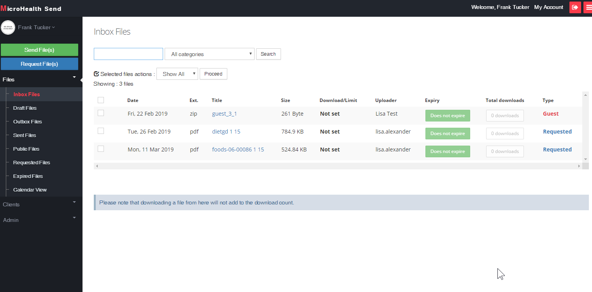

# mSend
##Forked from ProjectSend
This is a simple managed file system transfer.  Looks like an email program and works like one to.  You can send a file, request a file, set limits on the number of downloads or time and categorize files.  Up to 2 gigs you set in php.ini.  Features drag and drop.  Once the time or download limit is reached, the file is deleted.  Files are encrypted for added security. Enhanced social login including SAML. Its also responsive to work on mobile.  Completely brand it yourself...configurations are in the menu for administrators.

## Prerequisites:

# 1.  Install Apache

yum -y install httpd

systemctl start httpd.service

systemctl enable httpd.service

# 2.  open firewall ports

yum install firewalld -y

systemctl start firewalld

systemctl enable firewalld

systemctl status firewalld

(IF ANY ERRORS RUN THE FOLLOWING: systemctl restart dbus systemctl restart firewalld)

firewall-cmd --permanent --zone=public --add-service=http 

firewall-cmd --permanent --zone=public --add-service=https

firewall-cmd --reload

# 3.  Install PHP

yum install -y epel-release

yum install -y http://rpms.remirepo.net/enterprise/remi-release-7.rpm

yum install -y yum-utils

yum-config-manager --enable remi-php72

yum update

yum install -y php72

yum install -y php72-php-fpm php72-php-gd php72-php-json php72-php-mbstring php72-php-mysqlnd php72-php-xml php72-php-xmlrpc php72-php-opcache php php-common php-opcache php-mcrypt php-cli php-gd php-curl php-mysqlnd

# 3.1.Install PHP DOM extension and Enable PHP DOM extension.

yum -y install php-xml

# 3.2 Install and enable ZIP extension

yum install php-pecl-zip

echo "extension=zip.so" >> /etc/php.d/zip.ini

# 3.3 install imagick extension and enable

yum install php-pear php-devel gcc 

yum install ImageMagick ImageMagick-devel ImageMagick-perl

yum install ImageMagick ImageMagick-devel

yum install gcc make automake php-pear php-devel

pecl install imagick

# 3.3.1 Change permission

Add extension=imagick.so before ";End" in php.ini

To check php.ini location use 
php -i | grep "Loaded Configuration File" 

chown apache:apache /usr/lib64/php/modules/imagick.so

chmod 644 /etc/php.ini

Change these two fields

upload_max_filesize = 1024M

post_max_size = 1024M
 
Restart Apache

service httpd restart

# 4.  Create a new mariadb database on your server. Create/assign a user to it.

Get the latest mariadb (YOU CANNOT USE MYSQL versions earlier than 5.6 or Maridb earlier than 10.1)

nano /etc/yum.repos.d/MariaDB.repo

paste-----

[mariadb]

name = MariaDB

baseurl = http://yum.mariadb.org/10.1/centos7-amd64

gpgkey=https://yum.mariadb.org/RPM-GPG-KEY-MariaDB

gpgcheck=1

-----end paste

yum install MariaDB-server MariaDB-client -y

yum install  MariaDB-devel

systemctl start mariadb

systemctl enable mariadb

mysql_secure_installation
 - configure your installation by following the instructions
 
mysql -u root -p

mysql>CREATE USER 'user'@'hostname';

mysql>  create database database_name CHARACTER SET utf8 COLLATE utf8_general_ci;

mysql> GRANT ALL PRIVILEGES ON *.* TO 'username'@'hostname' IDENTIFIED BY 'password';

exit

# 5. Install the application
cd /var/www

yum install -y git

git clone https://github.com/MicroHealthLLC/mSend

don't forget to configure apache to serve up this root directory of /var/www/mSend

systemctl restart httpd

# 6. Change permissions for directory

chown -R apache:apache /var/www/mSend

sudo systemctl restart httpd.service

# 6.1 Permissions for PHP file upload

chcon -R -t httpd_sys_rw_content_t /var/www/mSend/upload

chcon -R -t httpd_sys_rw_content_t /var/www/mSend/img
 
(Continue the installation by using the URL)
 
# 7. Setup Email

Install sendmail extension

yum install sendmail sendmail-cf m4
 
check the service whether it's started or not by executing the following command
service sendmail status
 
start the service if it is not running by the following command

service sendmail start

yum install mailx

Check httpd_can_sendmail

getsebool httpd_can_sendmail

You can enable it by calling the command below.

sudo setsebool -P httpd_can_sendmail 1
 
----- Configure SMTP via admin panel

When those are steps are completed, follow this instructions:

1. Rename includes/sys.config.sample.php to sys.config.php and set your database info there.
2. Open your browser and go to http://hostname/install
3. Complete the information there and wait for the correct installation message.
4. go to the settings page to setup all the keys for social authentication and email.
5. Don't forget to configure PHP.ini https://mediatemple.net/community/products/dv/204404784/how-do-i-increase-the-php-upload-limits

Congratulations! MicroHealth Send is now installed and ready for action!
You may login with your new username and password.

## How to upgrade to a newer version:

1. cd /var/www/mSend
2. git pull
3.  systemctl restart httpd

That's it!
Your personal configuration file (sys.config.php) is never included on the downloadable versions, so it will not be replaced while upgrading.
When a system user logs in to the system version, a check for database missing data will be made, and if anything is found, it will be updated automatically and a message will appear under the menu one time only.
Whenever a new version is available, you will be notified in the admin panel via a message shown under the main menu.

